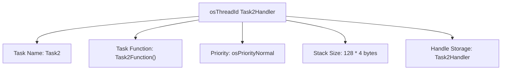

# FreeRTOS 튜토리얼 #2 - 태스크(Task) 기본 개념 및 활용 (CMSIS-OS v1)

이 문서는 Task 생성, 실행 전환, 잠시 멈춤(일시 중지), 다시 시작(재개), 그리고 완전히 끝내는(종료) 확인하기 위함

## 1. 프로젝트 개요: FreeRTOS 태스크 마스터하기

이 튜토리얼은 STM32 마이크로컨트롤러에서 CMSIS-OS v1 API를 사용함.

**💡 잠깐! '태스크(Task)'란 ?**
마이크로컨트롤러가 동시에 여러 가지 일을 처리하는 것처럼 보이게 하는 FreeRTOS의 기본 작업 단위를 '태스크'라고 합니다. 마치 컴퓨터에서 여러 프로그램을 동시에 실행하는 것과 비슷하다고 생각할 수 있습니다. 예를 들어, 하나의 태스크는 LED를 깜빡이고, 다른 태스크는 센서 값을 읽는 일을 담당할 수 있습니다.

## 2. STM32CubeIDE 설정 가이드: FreeRTOS 준비하기

STM32CubeIDE에서 FreeRTOS를 사용하기 위한 주요 설정 단계는 다음과 같습니다.

### 2.1. FreeRTOS 활성화 및 설정

-   **Middleware > FREERTOS:**
    -   **Interface:** `CMSIS_V1`을 선택합니다. (대부분의 STM32 장치에서 표준으로 지원하는 인터페이스입니다.)
    -   **Include Parameters:** `vTaskDelayUntil` 옵션을 활성화합니다. 이 옵션은 태스크가 정확히 정해진 시간 간격으로 반복 실행 (예: 1초마다 센서 값을 읽는 태스크)
    - ** Core > Inc > FreeRTOSConfig.h ** 코드 아래와 같이 변경 (GUI 사용 안할 시 , Optional)
        ```code
            #define INCLUDE_vTaskDelayUntil              0
        ```

## 3. FreeRTOS 태스크의 핵심 동작 이해하기

이제 FreeRTOS 태스크가 어떻게 동작하는지, 그리고 이를 어떻게 제어하는지 알아봅시다.

### 3.1. 태스크 생성: 새로운 작업 시작하기

새로운 태스크를 만들고 실행 준비를 시키는 과정입니다.





1.  **태스크 핸들 정의:** `osThreadId Task2Handler;`
    -   `Task2Handler`는 우리가 만든 태스크를 가리키는 '이름표' 또는 '주소'와 같습니다. 이 이름표를 통해 나중에 태스크를 제어할 수 있습니다.
2.  **태스크 정의 (`osThreadDef`):** `osThreadDef (Task2, task2_init, osPriorityNormal, 0, 128);`
    -   `Task2`: 이 태스크의 고유한 이름입니다.
    -   `task2_init`: 이 태스크가 시작되면 가장 먼저 실행될 '함수'입니다. 태스크의 실제 작업 코드가 이 함수 안에 들어갑니다.
    -   `osPriorityNormal`: 이 태스크의 '우선순위'입니다. FreeRTOS는 우선순위가 높은 태스크에게 CPU 사용 권한을 먼저 줍니다. `osPriorityNormal`은 보통 수준의 우선순위입니다.
    -   `0`: 사용되지 않는 파라미터입니다.
    -   `128`: 이 태스크가 사용할 '메모리 공간(스택 크기)'입니다. 태스크가 복잡한 작업을 할수록 더 많은 메모리가 필요할 수 있습니다.
3.  **태스크 생성 (`osThreadCreate`):** `Task2Handler = osThreadCreate(osThread(Task2), NULL);`
    -   실제로 위에서 정의한 내용을 바탕으로 태스크를 만들고, `Task2Handler`에 그 태스크의 이름표를 할당합니다. 이제 태스크가 실행될 준비가 되었습니다!
4.  **태스크 진입 함수 구현:** 태스크가 수행할 코드를 `void task2_init (void const * argument)` 함수 내에 작성합니다. 이 함수는 한 번 실행되고 끝나는 것이 아니라, 태스크가 살아있는 동안 계속 반복해서 실행됩니다.

### 3.2. 태스크 전환: 여러 작업을 번갈아 처리하기

FreeRTOS 커널(운영체제의 핵심 부분)은 여러 태스크가 마치 동시에 실행되는 것처럼 보이도록 '태스크 전환'을 수행합니다.

-   **어떻게 전환될까요?**
    -   **우선순위 기반:** FreeRTOS는 항상 가장 높은 우선순위를 가진 '준비된' 태스크를 실행합니다.
    -   **시간 분할:** 같은 우선순위의 태스크가 여러 개 있다면, FreeRTOS는 각 태스크에게 아주 짧은 시간(타임 슬라이스)씩 번갈아 CPU를 사용하게 합니다.
    -   **블로킹 상태:** 만약 어떤 태스크가 특정 이벤트(예: 일정 시간 대기, 데이터 수신)를 기다리며 '잠시 멈춤(블로킹)' 상태가 되면, FreeRTOS는 즉시 다른 태스크에게 CPU 사용 권한을 넘겨줍니다.
-   **비유:** 마치 한 명의 요리사가 여러 요리(태스크)를 동시에 만드는 것과 같습니다. 요리사(CPU)는 가장 중요한 요리(높은 우선순위 태스크)부터 신경 쓰고, 어떤 요리가 재료를 기다리거나(블로킹) 잠시 끓이는 동안에는 다른 요리로 넘어갑니다.

### 3.3. 태스크 일시 중지 및 재개: 잠시 멈췄다가 다시 시작하기

특정 태스크의 실행을 잠시 멈추거나, 멈췄던 태스크를 다시 시작할 때 사용합니다.

-   **일시 중지:** `osThreadSuspend(ThreadID);`
    -   이 함수가 호출되면 해당 `ThreadID`를 가진 태스크는 '일시 중지' 상태가 되어 더 이상 실행되지 않습니다. 마치 게임을 '일시 정지'하는 것과 같습니다.
-   **재개:** `osThreadResume(ThreadID);`
    -   일시 중지되었던 태스크를 다시 '재개'하여 실행 가능한 상태로 만듭니다. '일시 정지'된 게임을 다시 '재생'하는 것과 같습니다.

**예시:**
```c
if (indx == 4) {
    printf("suspending DefaultTask\n"); // DefaultTask를 일시 중지합니다.
    osThreadSuspend(defaultTaskHandle);
}
if (indx == 7) {
    printf("Resuming DefaultTask\n"); // DefaultTask를 다시 시작합니다.
    osThreadResume(defaultTaskHandle);
}
```

### 3.4. 태스크 종료: 작업을 완전히 끝내기

더 이상 필요 없는 태스크를 시스템에서 완전히 제거할 때 사용합니다.

-   **종료:** `osThreadTerminate(ThreadID);`
    -   이 함수가 호출되면 해당 `ThreadID`를 가진 태스크는 시스템에서 완전히 사라집니다. 한 번 종료된 태스크는 다시 재개될 수 없으며, 마치 컴퓨터에서 프로그램을 완전히 '종료'하는 것과 같습니다.

**예시:**
```c
if (indx == 3) {
    printf("Terminating DefaultTask\n"); // DefaultTask를 완전히 종료합니다.
    osThreadTerminate(defaultTaskHandle);
}
```

### 3.5. 특정 시간까지 태스크 블록 (`osDelayUntil`): 정확한 시간 간격으로 반복하기

`osDelayUntil` 함수는 태스크가 정확히 정해진 시간 간격으로 반복 실행되도록 할 때 매우 유용합니다.

-   **구문:** `osDelayUntil (uint32_t *PreviousWakeTime, uint32_t millisec)`
    -   `PreviousWakeTime`: 이 태스크가 마지막으로 깨어난(실행된) 시간을 기록하는 변수의 '주소'입니다. FreeRTOS는 이 값을 기준으로 다음 실행 시간을 정확히 계산합니다.
    -   `millisec`: 태스크가 다음 번에 깨어나기까지 기다릴 '시간 간격' (밀리초 단위)입니다.
-   **동작 방식:** `osDelayUntil`은 태스크를 `millisec` 간격으로 정확하게 실행되도록 합니다. 만약 태스크가 `millisec`보다 짧게 실행되면, 남은 시간만큼 대기하고, 만약 `millisec`보다 길게 실행되면 즉시 다음 주기를 시작합니다. 이는 `osDelay` (단순히 지정된 시간만큼 대기)와는 다르게, 누적되는 시간 오차 없이 정확한 주기성을 보장합니다.
-   **비유:** 마치 알람 시계를 맞춰놓고 정확히 1시간마다 울리게 하는 것과 같습니다. 중간에 다른 일을 하더라도, 다음 알람은 정확히 1시간 뒤에 울립니다.

**예시:**
```c
if (indx == 3) {
    uint32_t PreviousWakeTime = osKernelSysTick(); // 현재 시간을 기록합니다.
    // 이 태스크는 PreviousWakeTime을 기준으로 4000밀리초(4초)마다 정확히 실행됩니다.
    osDelayUntil(&PreviousWakeTime, 4000);
}
```
