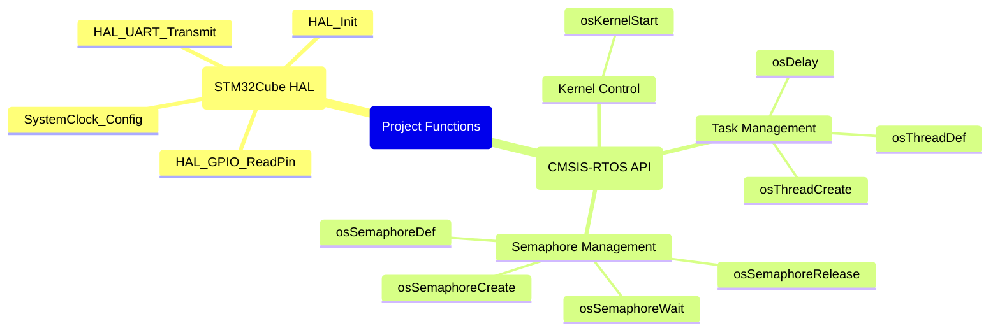

# Nucleo-F429ZI FreeRTOS 세마포어 프로젝트

이 프로젝트는 **공유 자원(UART)에 대한 여러 태스크의 동시 접근을 안전하게 제어**하기 위한 FreeRTOS **바이너리 세마포어(Binary Semaphore)의 활용 예제**입니다. 특히, 여러 태스크가 동시에 UART로 메시지를 출력할 때 내용이 섞이는 **데이터 혼란(Data Corruption)을 방지**하는 방법을 보여줍니다.

## 1. 사용된 함수 구조 (Mermaid Mindmap)

이 프로젝트에서 사용된 주요 FreeRTOS(CMSIS-RTOS) 및 HAL 함수들의 구조를 마인드맵으로 시각화했습니다.



## 2. 개념 설명: 세마포어와 바이너리 세마포어

### 세마포어 (Semaphore)
세마포어는 여러 태스크(Task)가 공유된 자원(Shared Resource)에 접근하는 것을 제어하기 위한 동기화 도구입니다. 가장 쉬운 비유는 '놀이공원의 한정된 수의 보트'입니다. 세마포어는 현재 사용 가능한 자원의 개수를 세는 카운터처럼 동작하여, 정해진 수의 태스크만 자원에 접근하도록 허용합니다.

### 바이너리 세마포어 (Binary Semaphore)

바이너리 세마포어는 카운터 값이 0 또는 1만 가질 수 있는 특별한 형태의 세마포어입니다. '화장실의 단 하나뿐인 열쇠'에 비유할 수 있습니다.
- **1 (Available)**: 자원을 사용할 수 있음 (열쇠가 있음)
- **0 (Taken)**: 자원이 사용 중임 (열쇠가 없음)

**이 예제에서 바이너리 세마포어를 사용하는 이유:**

이 프로젝트에는 `HighTask`, `NormalTask`, `LowTask` 세 가지 태스크가 있습니다. 이 태스크들은 각각 다른 우선순위를 가지고 있으며, 공통적으로 **UART(시리얼 통신)**를 통해 메시지를 출력하는 작업을 수행합니다.

**문제점 (세마포어 미사용 시):**
만약 여러 태스크가 동시에 UART와 같은 공유 자원에 접근하여 데이터를 출력하려고 하면, 각 태스크의 출력 순서가 보장되지 않아 메시지가 서로 뒤섞여(Interleaving) 읽기 어려운 형태로 출력되는 **데이터 혼란(Data Corruption)**이 발생할 수 있습니다. 예를 들어, `HighTask`가 "High Task Message"를 출력하는 도중에 `NormalTask`가 "Normal Task Message"를 출력하기 시작하면, 시리얼 터미널에는 "High Noraml Task Message Task Message"와 같이 섞인 문자열이 나타날 수 있습니다.

**해결책 (바이너리 세마포어 사용):**
이러한 데이터 혼란을 방지하기 위해 바이너리 세마포어를 사용합니다. 바이너리 세마포어는 UART라는 공유 자원에 대한 **상호 배제(Mutual Exclusion)**를 구현하는 데 이상적입니다.

1.  **자원 보호**: UART를 사용하기 전에 태스크는 반드시 바이너리 세마포어를 획득(Take)해야 합니다. 세마포어를 획득한 태스크만이 UART를 사용할 수 있습니다.
2.  **대기 및 순차 처리**: 만약 다른 태스크가 이미 세마포어를 획득하여 UART를 사용 중이라면, 세마포어를 획득하려는 태스크는 세마포어가 해제(Release)될 때까지 대기(Block)합니다.
3.  **자원 반환**: UART 사용을 마친 태스크는 세마포어를 해제하여 다른 태스크가 UART를 사용할 수 있도록 허용합니다.

이러한 메커니즘을 통해, 아무리 많은 태스크가 동시에 UART에 접근하려 해도, 바이너리 세마포어가 '열쇠' 역할을 하여 **오직 하나의 태스크만이 한 번에 UART를 사용할 수 있도록 보장**합니다. 결과적으로, 출력 메시지가 뒤섞이는 현상 없이 각 태스크의 메시지가 온전하게 순차적으로 출력됩니다.

### 세마포어 주요 함수 설명

FreeRTOS(CMSIS-RTOS API)에서 바이너리 세마포어를 다루는 주요 함수들은 다음과 같습니다:

*   **`osSemaphoreCreate` (Create)**:
    *   **역할**: 새로운 세마포어를 생성하고 초기화합니다. 바이너리 세마포어의 경우, 초기 값을 1로 설정하여 자원이 사용 가능함을 나타냅니다.
    *   **예시**: `BinSemHandle = osSemaphoreCreate(osSemaphore(BinSem), 1);`

*   **`osSemaphoreWait` (Wait/Take)**:
    *   **역할**: 태스크가 세마포어를 획득(take)하려고 시도합니다. 세마포어 값이 1이면 0으로 감소시키고 즉시 자원을 획득합니다. 세마포어 값이 0이면, 태스크는 세마포어가 `release`될 때까지 대기(block)합니다. `osWaitForever`는 무한정 대기함을 의미합니다.
    *   **예시**: `osSemaphoreWait(BinSemHandle, osWaitForever);`

*   **`osSemaphoreRelease` (Release/Give)**:
    *   **역할**: 태스크가 사용을 마친 자원을 반환하고 세마포어를 해제(give)합니다. 세마포어 값을 0에서 1로 증가시킵니다. 이 때, 세마포어를 기다리던 다른 태스크가 있다면, 가장 높은 우선순위의 태스크가 대기 상태에서 벗어나 자원을 획득할 수 있게 됩니다.
    *   **예시**: `osSemaphoreRelease(BinSemHandle);`

*   **`osSemaphoreDelete` (Delete)**:
    *   **역할**: 더 이상 필요 없는 세마포어를 시스템에서 제거하고 할당된 메모리를 해제합니다. 일반적으로 애플리케이션 종료 시 또는 특정 세마포어가 영구적으로 사용되지 않을 때 호출됩니다. 이 프로젝트에서는 명시적으로 사용되지 않지만, 세마포어 관리의 중요한 부분입니다.
    *   **예시**: (이 프로젝트에는 없음)

## 3. STM32CubeMX 설정 (`.ioc` 파일)

이 예제를 구성하기 위해 STM32CubeMX에서 설정해야 할 주요 항목입니다.

1.  **프로젝트 생성**:
    *   STM32CubeMX에서 새 프로젝트를 생성하며 MCU를 `STM32F429ZITx`로 선택합니다.

2.  **Middleware 설정**:
    *   `Middleware` > `FREERTOS` 클릭 후 `Interface`를 `CMSIS_V1`으로 설정합니다.

3.  **FreeRTOS 태스크 및 세마포어 추가**:
    *   `FREERTOS` 설정 창의 `Tasks and Queues` 탭에서 아래 3개의 태스크를 추가합니다:
        *   `HighTask` (Priority: `osPriorityAboveNormal`)
        *   `NormalTask` (Priority: `osPriorityNormal`)
        *   `LowTask` (Priority: `osPriorityBelowNormal`)
    *   `Timers and Semaphores` 탭에서 `Type`이 `Binary`인 세마포어(`BinSem`)를 하나 추가합니다.

4.  **핀 설정**:
    *   **UART 설정**: `Connectivity` > `USART3`를 `Asynchronous` 모드로 활성화합니다. (Nucleo-F429ZI의 가상 COM 포트는 USART3에 연결됨, 핀: `PD8`, `PD9`)
    *   **버튼 설정**: `System Core` > `GPIO`에서 `PC13` 핀을 `GPIO_Input` 모드로 설정합니다. (파란색 사용자 버튼)

5.  **클럭 설정**:
    *   `Clock Configuration` 탭에서 `HCLK`를 `180` MHz로 설정합니다.

## 4. 주요 코드 (`Core/Src/main.c`)

STM32CubeMX에서 코드를 생성한 후, `main.c` 파일의 `/* USER CODE BEGIN ... */` 영역에 다음과 같은 코드를 직접 추가해야 합니다.

### 1. 세마포어 및 태스크 핸들 변수 선언
```c
/* Private variables ---------------------------------------------------------*/
UART_HandleTypeDef huart3;

/* USER CODE BEGIN PV */
osThreadId NormalTaskHandle;
osThreadId HighTaskHandle;
osThreadId LowTaskHandle;
osSemaphoreId BinSemHandle;
/* USER CODE END PV */
```

### 2. 세마포어 및 태스크 생성
`main()` 함수 내에서 세마포어와 태스크를 생성합니다.
```c
/* main function */
int main(void)
{
  // ... System Init ...

  /* Create the semaphores(s) */
  osSemaphoreDef(BinSem);
  BinSemHandle = osSemaphoreCreate(osSemaphore(BinSem), 1);

  /* Create the thread(s) */
  osThreadDef(NormalTask, Startnormaltask, osPriorityNormal, 0, 128);
  NormalTaskHandle = osThreadCreate(osThread(NormalTask), NULL);

  osThreadDef(HighTask, Starthightask, osPriorityAboveNormal, 0, 128);
  HighTaskHandle = osThreadCreate(osThread(HighTask), NULL);

  osThreadDef(LowTask, Startlowtask, osPriorityBelowNormal, 0, 128);
  LowTaskHandle = osThreadCreate(osThread(LowTask), NULL);

  /* Start scheduler */
  osKernelStart();
  
  // ...
}
```

### 3. 태스크 함수 구현
각 태스크 함수에서 `HAL_UART_Transmit` 호출 시 `&huart3`를 사용합니다.
```c
/* HighTask implementation */
void Starthightask(void const * argument)
{
  for(;;)
  {
    // ...
    HAL_UART_Transmit(&huart3, (uint8_t *) str1, strlen (str1), 100);
    // ...
    osSemaphoreWait(BinSemHandle, osWaitForever);
    // ...
    HAL_UART_Transmit(&huart3, (uint8_t *) str3, strlen (str3), 100);
    // ...
    osSemaphoreRelease(BinSemHandle);
    osDelay(500);
  }
}
```

## 5. 하드웨어 요구사항

-   **Nucleo-F429ZI** 보드
-   전원 및 프로그래밍/디버깅을 위한 USB 케이블

## 6. 사용 방법

1.  위 `3. STM32CubeMX 설정`을 참고하여 프로젝트를 구성합니다.
2.  `Project > Build All`을 클릭하여 **프로젝트를 빌드합니다**.
3.  `Run > Debug`를 클릭하여 **디버거를 실행합니다**.
4.  `Run > Resume`을 클릭하여 **실행을 시작합니다**.
5.  PC에서 ST-Link의 가상 COM 포트에 연결된 **시리얼 터미널**을 엽니다.
    -   **Baud Rate**: 115200, **Data Bits**: 8, **Parity**: None, **Stop Bits**: 1
6.  **출력을 관찰합니다**. `LowPriorityTask`가 세마포어를 획득한 후 진행하려면 Nucleo 보드의 사용자 버튼(파란색 버튼)을 누르십시오.