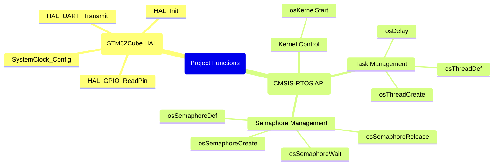

# Nucleo-F429ZI FreeRTOS 세마포어 프로젝트

이 프로젝트는 STM32CubeIDE를 사용하여 구성된 **Nucleo-F429ZI** 보드에서 FreeRTOS의 **바이너리 세마포어(Binary Semaphore)** 사용법을 보여주는 예제입니다.

## 1. 사용된 함수 구조 (Mermaid Mindmap)

이 프로젝트에서 사용된 주요 FreeRTOS(CMSIS-RTOS) 및 HAL 함수들의 구조를 마인드맵으로 시각화했습니다.



## 2. 개념 설명: 세마포어와 바이너리 세마포어

### 세마포어 (Semaphore)
세마포어는 여러 태스크(Task)가 공유된 자원(Shared Resource)에 접근하는 것을 제어하기 위한 동기화 도구입니다. 가장 쉬운 비유는 '놀이공원의 한정된 수의 보트'입니다. 세마포어는 현재 사용 가능한 자원의 개수를 세는 카운터처럼 동작하여, 정해진 수의 태스크만 자원에 접근하도록 허용합니다.

### 바이너리 세마포어 (Binary Semaphore)
바이너리 세마포어는 카운터 값이 0 또는 1만 가질 수 있는 특별한 형태의 세마포어입니다. '화장실의 단 하나뿐인 열쇠'에 비유할 수 있습니다.
- **1 (Available)**: 자원을 사용할 수 있음 (열쇠가 있음)
- **0 (Taken)**: 자원이 사용 중임 (열쇠가 없음)

오직 하나의 태스크만 자원에 접근해야 하는 **상호 배제(Mutual Exclusion)** 상황에서 주로 사용됩니다. 이 프로젝트에서는 여러 태스크가 동시에 UART로 메시지를 출력하여 내용이 섞이는 것을 방지하기 위해 바이너리 세마포어를 사용합니다.

## 3. STM32CubeMX 설정 (`.ioc` 파일)

이 예제를 구성하기 위해 STM32CubeMX에서 설정해야 할 주요 항목입니다.

1.  **프로젝트 생성**:
    *   STM32CubeMX에서 새 프로젝트를 생성하며 MCU를 `STM32F429ZITx`로 선택합니다.

2.  **Middleware 설정**:
    *   `Middleware` > `FREERTOS` 클릭 후 `Interface`를 `CMSIS_V1`으로 설정합니다.

3.  **FreeRTOS 태스크 및 세마포어 추가**:
    *   `FREERTOS` 설정 창의 `Tasks and Queues` 탭에서 아래 3개의 태스크를 추가합니다:
        *   `HighTask` (Priority: `osPriorityAboveNormal`)
        *   `NormalTask` (Priority: `osPriorityNormal`)
        *   `LowTask` (Priority: `osPriorityBelowNormal`)
    *   `Timers and Semaphores` 탭에서 `Type`이 `Binary`인 세마포어(`BinSem`)를 하나 추가합니다.

4.  **핀 설정**:
    *   **UART 설정**: `Connectivity` > `USART3`를 `Asynchronous` 모드로 활성화합니다. (Nucleo-F429ZI의 가상 COM 포트는 USART3에 연결됨, 핀: `PD8`, `PD9`)
    *   **버튼 설정**: `System Core` > `GPIO`에서 `PC13` 핀을 `GPIO_Input` 모드로 설정합니다. (파란색 사용자 버튼)

5.  **클럭 설정**:
    *   `Clock Configuration` 탭에서 `HCLK`를 `180` MHz로 설정합니다.

## 4. 주요 코드 (`Core/Src/main.c`)

STM32CubeMX에서 코드를 생성한 후, `main.c` 파일의 `/* USER CODE BEGIN ... */` 영역에 다음과 같은 코드를 직접 추가해야 합니다.

### 1. 세마포어 및 태스크 핸들 변수 선언
```c
/* Private variables ---------------------------------------------------------*/
UART_HandleTypeDef huart3;

/* USER CODE BEGIN PV */
osThreadId NormalTaskHandle;
osThreadId HighTaskHandle;
osThreadId LowTaskHandle;
osSemaphoreId BinSemHandle;
/* USER CODE END PV */
```

### 2. 세마포어 및 태스크 생성
`main()` 함수 내에서 세마포어와 태스크를 생성합니다.
```c
/* main function */
int main(void)
{
  // ... System Init ...

  /* Create the semaphores(s) */
  osSemaphoreDef(BinSem);
  BinSemHandle = osSemaphoreCreate(osSemaphore(BinSem), 1);

  /* Create the thread(s) */
  osThreadDef(NormalTask, Startnormaltask, osPriorityNormal, 0, 128);
  NormalTaskHandle = osThreadCreate(osThread(NormalTask), NULL);

  osThreadDef(HighTask, Starthightask, osPriorityAboveNormal, 0, 128);
  HighTaskHandle = osThreadCreate(osThread(HighTask), NULL);

  osThreadDef(LowTask, Startlowtask, osPriorityBelowNormal, 0, 128);
  LowTaskHandle = osThreadCreate(osThread(LowTask), NULL);

  /* Start scheduler */
  osKernelStart();
  
  // ...
}
```

### 3. 태스크 함수 구현
각 태스크 함수에서 `HAL_UART_Transmit` 호출 시 `&huart3`를 사용합니다.
```c
/* HighTask implementation */
void Starthightask(void const * argument)
{
  for(;;)
  {
    // ...
    HAL_UART_Transmit(&huart3, (uint8_t *) str1, strlen (str1), 100);
    // ...
    osSemaphoreWait(BinSemHandle, osWaitForever);
    // ...
    HAL_UART_Transmit(&huart3, (uint8_t *) str3, strlen (str3), 100);
    // ...
    osSemaphoreRelease(BinSemHandle);
    osDelay(500);
  }
}
```

## 5. 하드웨어 요구사항

-   **Nucleo-F429ZI** 보드
-   전원 및 프로그래밍/디버깅을 위한 USB 케이블

## 6. 사용 방법

1.  위 `3. STM32CubeMX 설정`을 참고하여 프로젝트를 구성합니다.
2.  `Project > Build All`을 클릭하여 **프로젝트를 빌드합니다**.
3.  `Run > Debug`를 클릭하여 **디버거를 실행합니다**.
4.  `Run > Resume`을 클릭하여 **실행을 시작합니다**.
5.  PC에서 ST-Link의 가상 COM 포트에 연결된 **시리얼 터미널**을 엽니다.
    -   **Baud Rate**: 115200, **Data Bits**: 8, **Parity**: None, **Stop Bits**: 1
6.  **출력을 관찰합니다**. `LowPriorityTask`가 세마포어를 획득한 후 진행하려면 Nucleo 보드의 사용자 버튼(파란색 버튼)을 누르십시오.